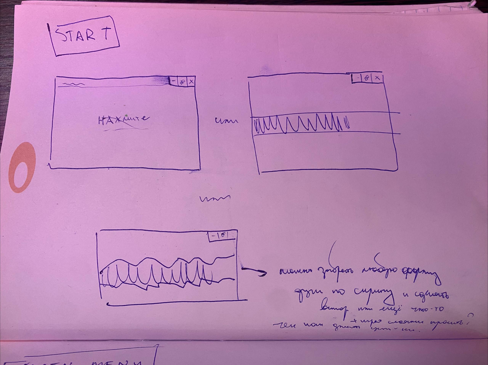
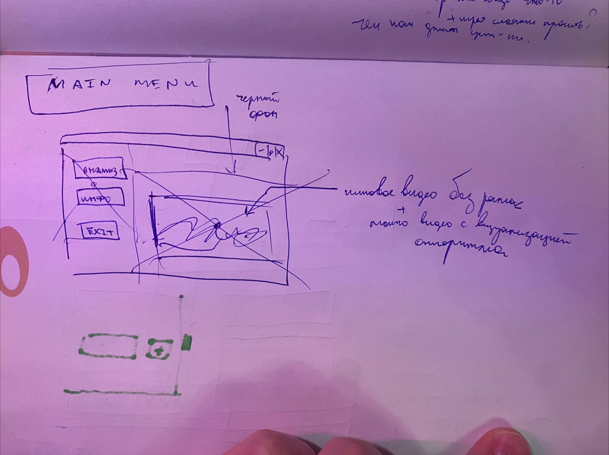
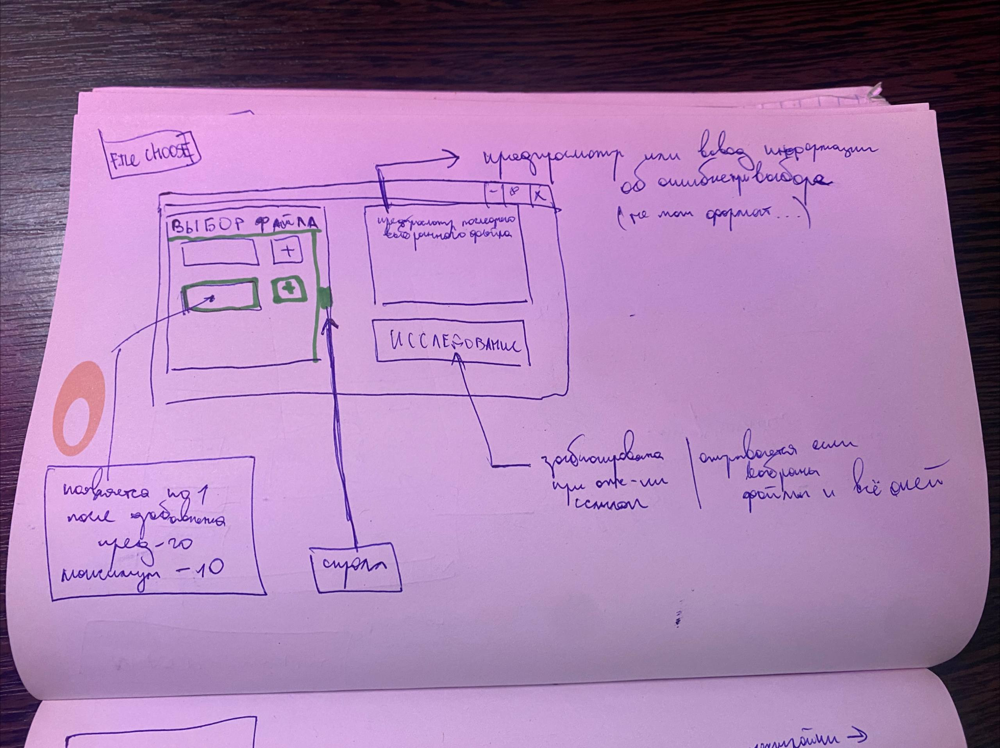
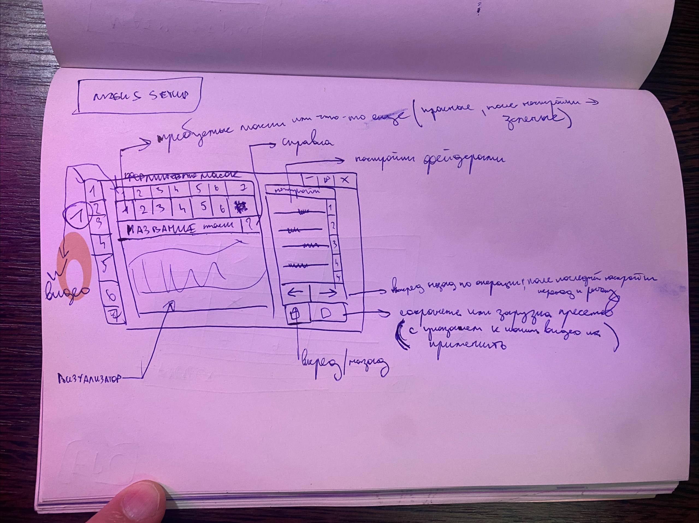
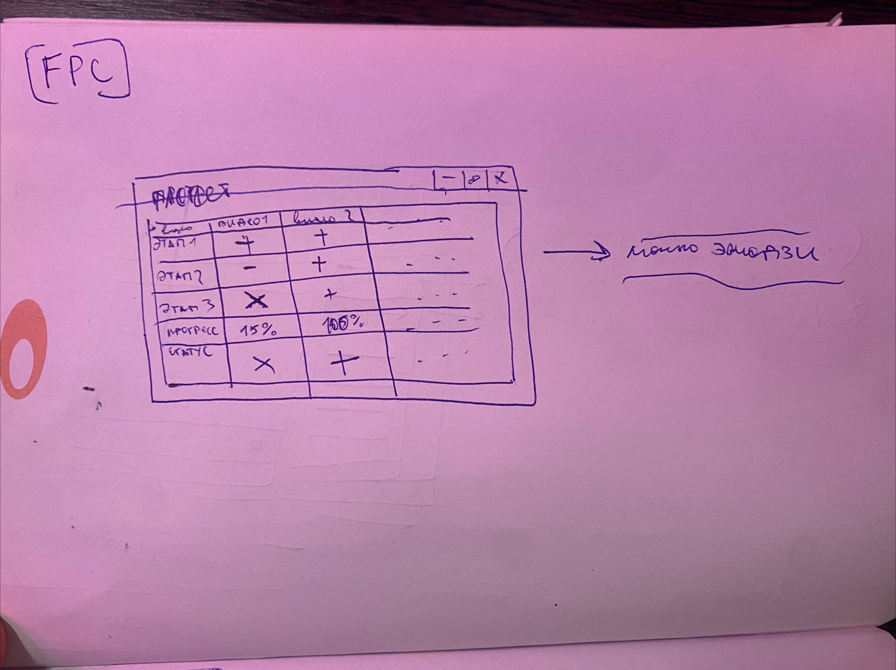
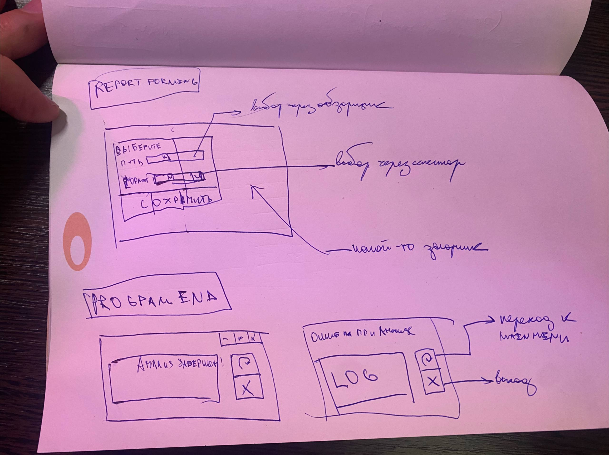

# Описание

Дизайн представляет из себя нечто среднее между поэтапными установщиками программ и vst-плагинами с дизайном в стиле необрутализм

# Референсы

Компоновка:

Элементики:

Цвета:

# Эскизы

{{0},       "START"},                           // Просто запуск программы, загрузка чего-то, подготовка к работе

{{1},       "MAIN_MENU"},                       // Дать возможность начать работу с программой или выйти

{{1,1},     "FILE_CHOOSE"},                     // Меню выбора файлов для обработки  

{{1,2},     "MASKS_SETUP"},                     // Меню выбора параметров масок для обработки видео  

{{1,3},     "FLOW_PARAMETERS_CALCULATION"},     // Расчёт + статус бар + прогресс бар по каждому видео + сигнализация по успеху (с переходом вперед) неудаче (переход назад + лог)

{{1,4},     "REPORT_FORMING"},                  // Формирование отчёта + выбор места сохранения + сигнализация об успехе + переход к следующему этапу

{{2},       "PROGRAM_END"}                      // Сообщение о завершении работы + переход на этап MAIN_MENU при нажатии любой клавиши

 

# Используемые элементы UI

1) Панели (внутрь которой можно разместить что угодно)
2) Кнопки - (с текстом или изображениями внутри)
3) Селекторы (выбор формата - можно заменить или убрать)
4) Фейдеры (изменение значения)
5) Слайдеры (прокрутка)
6) Загрузчик - реализовывать только если останется время