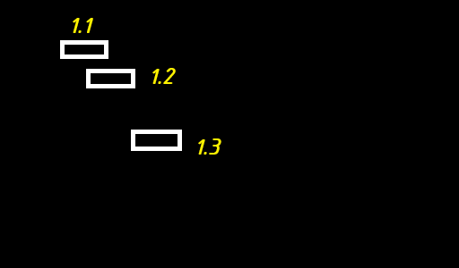
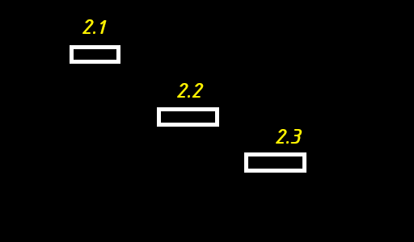

# Particles detection

## Раздел: Анализ характера визуализации частиц и обоснование алгоритма детекции

При детальном анализе бинарных масок, полученных на этапе предварительной сегментации изображений, был выявлен специфический оптико-геометрический артефакт. Индивидуальные частицы в пределах одного кадра визуализируются в виде протяженных горизонтальных штрихов (линий), у которых координата по оси \(Y\) для крайних точек единичного трека остается неизменной (\(\Delta Y_{intra} \approx 0\)).

Однако экспертный визуальный анализ межкадровой динамики (оценка последовательности кадров человеком) выявил значительное пространственное смещение центров этих треков по вертикальной оси \(Y\) между последовательными кадрами (\(\Delta Y_{inter} \gg 0\)).

Наблюдаемый феномен объясняется анизотропной деформацией светового поля (эффектом спекл-структуры или дифракционного размытия) при импульсной лазерной подсветке, либо высокочастотными осцилляциями среды в плоскости, ортогональной вектору макро-переноса потока. В данных условиях геометрия и ориентация штриха на одиночном снимке отражают лишь мгновенные оптические характеристики системы в микросекундном диапазоне экспозиции строки/кадра и не имеют прямой корреляции с истинным вектором скорости объекта.В связи с этим первичная концепция поштучной детекции и анализа геометрии треков на изолированных кадрах признана неинформативной. 

Одиночный кадр обладает векторной слепотой и приводит к ложной интерпретации направления движения потока как строго горизонтального.Для обеспечения достоверности измерений осуществлен переход к двухкадровой расчетной схеме, соответствующей принципам PTV (Particle Tracking Velocimetry).

Модифицированный пайплайн обработки должен включать в себя:

1) Игнорирование линейной геометрии штрихов и их межкадровую редукцию (схлопывание) до геометрических центроидов (центров масс) контуров с помощью метода моментов второго порядка.
2) Попарный анализ смещения вычисленных центроидов между кадрами \(N\) и \(N+1\) с применением алгоритма линейного назначения (Венгерского алгоритма).
   
Данный подход позволяет полностью нивелировать влияние горизонтального оптического шума экспозиции и достоверно восстановить истинный вектор скорости и направления движения дисперсной фазы.


## Мысли по теории необходимого алгоритма

При формировании масок для трекинга частиц трек каждой частицы на кадре стал определен в виде белого прямоугольника на черном фоне, удобно транслируемого в центральную точку этого прямоугольника.

Предположим, что существует подобная последовательность кадров:

___
1:
___


___

и
___
2:
___


___


### Умозрительный анализ 

При экспертном анализе очевиден переход частицы 1.2 к 2.2 и частицы 1.3 к 2.3 и исчезновение частицы 1.1 с появлением частицы 2.1.

Данное умозаключение выдвинуто, исходя из известных фактов о рассматриваемом процессе:

1) Поток и частицы двигаются слева направо
2) На большем количестве кадров большинство частиц стремятся сместиться ниже за время между кадрами
3) Частицы двигаются примерно с одинаковой скоростью, поэтому крайние объекты в кадре (1.3 и 2.3) ассоциируются
4) Смещение 1.3 к 2.3 носит схожий характер только со смещением 1.2 к 2.2, при этом оставшиеся точки (1.1, 2.1) координально отличаются по смещению от среднего смещения - для n = 2 определенных смещений: dx = ((x_2.2 - x_1.2) + (x_2.3 - x_1.3)) / 2 и схожей функции для dy. Соответственно, логически 1.1 и 2.1 классифицируются, как разные объекты и выбрасываются из анализа на текущем кадре. При этом 1.1 может быть проанализирована с какой-либо точкой из кадра 0, а 2.1 с какой-либо точкой из кадра 3.


Исходя из этого, для первичного собственного алгоритма машинного зрения можно выделить следующие базовые правила ассоциации точек:

1) Допущение x_2 > x_1 для всех точек - анализируемой на предмет смещения точке с кадра "n" никогда не соответствует точека с кадра "n + 1", у которой значение x меньше, чем у анализируемой точки.
2) Допущение преобладания при равенстве прочих факторов соответствия точки с координатой y_2 > y_1 (SDL-подобная ориентация пространства) над точкой с y_2 < y_1 - из-за видимости смещения точек вниз


### Базовые идеи алгоритма анализа последовательности кадров 

Каждый объект на данных кадрах может с лёгкостью может быть представлен в виде его центральной точки средствами OpenCV.

При реализации анализа соответствия позиций объектам возможно ориентироваться по маркеру каких-либо предположительных смещений. Наилучшим вариантом является проход с предположительным медианным смещением, близким к действительному, однако, получение подобного значения при первичном анализе невозможно.

Для формирования близких к действительным медианных значений смещения объектов возможно провести предварительный первичный проход с ориентацией на смещения крайних точек. На кадрах "n" и "n + 1" возможно выделить 2 буфферные зоны с правого края кадра - зона "< 0.8 w_frame" и зона "< 0.9 w_frame". В данных зонах возможно выделить единственную "крайнюю частицу" по правилу:

```

Для кадра "n + 1" берем первую частицу справа в зоне "< 0.9 w_frame" с максимальным значением y (y_2) - ближайшую точку к правому нижниму краю кадра.

Для кадра "n" берем первую частицу справа в зоне " > 0.6 w_frame && < 0.8 w_frame" с y (y_1) < чем y для точки кадра "n + 1" и наименьшей дельтой y_2 - y_1 среди возможных точек. 

```

По данным точкам можно будет вычислить "типовые смещения кадра" dx_frame_n и dy_frame_n.

После чего возможно найти медианное типовое смещение "крайних точек" всех кадров анализируемого видео.


После предварительного прохода с поиском медианных смещений возможно произвести анализ соответствия точек по алгоритму:

1) Формируем контейнеры точками кадров "n" и "n + 1". Для примера выше - {1.1, 1.2, 1.3} и {2.1, 2.2, 2.3}
2) Формируем контейнер ответа анализа кадра формата {1.1 - ___, 1.2 - ____, 1.3 - ____}
3) Проходим циклом сравнения дельт координат точкек "n + 1" кадра по точкам с контейнера кадра "n", начиная с последней точки кадра "n" (1.3), анализируя дельты между этой точкой и всеми точками кадра "n + 1". Выбираем точку с наиболее близкими дельтами (через приведение близостей по каждой из координатам к значениям от 0.0 до 0.5) к медианным дельтам, найденным при предварительном проходе по анализируемому видео. При отсутвии на кадре "n + 1" точки с общей близостью дельт > 0.5 считаем объект исчезнувшим. Выставляем соответствие или статус исчезновения в контейнере ответов анализа кадра. Повторяем это действие для всех точек кадра "n".
4) Анализируем контейнер ответов на предмет повторов соответствия объектов с кадра "n + 1" нескольким объектам с кадра "n". При наличии повторов решаем конфликт путём выбора пары наиболее высоким соответствием дельты.
5) Формируем контейнера остатка (из всех объектов без пар)
6) Повторяем действия 3-4 для 2 контейнеров остатка.
7) Циклируем действия 3-6 до момента пока все объекты в контейнерах остатков 2 кадров не начнут иметь приведенную к единице общую близость дельт < 0.5.
8) Фиксируем финальный контейнер ответа в общем контейнере ответа.
9) Производим действия 1-8 для всех кадров (заканчивая предпоследним и последним).
10) Производим вычисления требуемых характеристик движения частиц (углы, скорости), используя общий контейнер ответов соответствия частиц. 
11) Формируем финальный контейнер ответов: медианная скорость частиц на видео, медианный угол движения частиц, среднее максимальное отклонение от медианного угла движения частиц. 


Допускается идея замены шага 11 на рассчёт новых значений медианных смещений частиц и повтор шагов 1-10 с использованием полученных медианных смещений вместо медианных смещений крайних точек. 


### Существующие алгоритмы решения подобных задач 

В области компьютерного зрения и гидроаэродинамики задача сопоставления множества дискретных объектов между кадрами классифицируется как Data Association (ассоциация данных) или Multi-Object Tracking (MOT). Исторически и практически для её решения сформировалось несколько фундаментальных подходов:

```
Алгоритм К Kuhn-Munkres (Венгерский алгоритм): Классический метод комбинаторной оптимизации, который решает задачу о назначениях. На вход подается матрица расстояний (стоимости) между всеми объектами кадра \(n\) и кадра \(n+1\). Алгоритм находит глобальный минимум суммы всех смещений, гарантируя математически оптимальное распределение пар «один-к-одному».

Ближайший сосед с глобальным стробированием (Global Nearest Neighbor, GNN): Жадный алгоритм, который ищет для каждой точки кадра \(n\) ближайшую по евклидову расстоянию точку на кадре \(n+1\). Чтобы избежать абсурдных связей, область поиска ограничивают пространственным стробом (Gating window), отсекающим движение в невозможных направлениях или на слишком высокой скорости.

Метод предиктивного трекинга частиц (Predictive PTV): Подход, разработанный специально для анализа физических потоков. Он использует физические допущения (например, непрерывность среды, сохранение импульса или монотонность направления течения) для предсказания области, в которой частица должна оказаться на следующем кадре.

Фильтр Калмана (Kalman Filter) + SORT (Simple Online and Realtime Tracking): Динамический подход, где для каждого объекта строится математическая модель его движения (скорость, ускорение). Фильтр Калмана предсказывает положение точки на кадре \(n+1\), а затем Венгерский алгоритм сопоставляет предсказание с реальными детекциями.
```


### Сравнительный анализ предложенного алгоритма с существующими 

Для наглядности сравним предложенный алгоритм с ключевыми промышленными стандартами по базовым критериям.

| Критерий сравнения | Предложенный алгоритм | Жадный алгоритм (GNN) + Gating | Венгерский алгоритм (Hungarian) |
| :--- | :--- | :--- | :--- |
| **Принцип поиска пар** | Итерационный «жадный» обход по матрице приведенных дельт, начиная с конца контейнера. | Жадный поиск строго минимального евклидова расстояния по всему кадру. | Глобальная оптимизация всей матрицы стоимостей (поиск суммарного минимума). |
| **Способ инициализации тренда** | **Динамический предварительный проход** по буферным зонам края кадра для вычисления стартовой медианы. | Ручная жесткая инициализация радиуса поиска (например, строб в 30 пикселей). | Не требует инициализации тренда (считает все расстояния между всеми точками). |
| **Устойчивость к входу/выходу объектов** | **Высокая**, за счет многоуровневых контейнеров остатков (шаги 5–7) и порога близости. | Низкая (может ошибочно привязать новую частицу к улетающей старой). | Высокая (решается введением штрафных стоимостей в матрицу). |
| **Вычислительная сложность** | Средняя. Зависит от количества итераций по контейнерам остатков. | Очень низкая $O(K \cdot L)$ — самый быстрый, но наименее точный метод. | Высокая $O(N^3)$ в классической реализации, требует больше ресурсов CPU. |


#### Почему алгоритм МОЖНО использовать (Плюсы решения):
1. **Идеальное соответствие физике процесса:** Введение концепции «медианного смещения кадра» на основе крайних точек — это сильное прикладное решение. В направленных потоках крайние точки кадра (выходная зона) наименее подвержены турбулентным завихрениям, поэтому их тренд действительно отражает общую скорость течения.
2. **Наличие контура разрешения конфликтов (Шаг 4):** Алгоритм не просто связывает первые попавшиеся точки, а проверяет контейнер на дубликаты и выбирает пару с наивысшим соответствием. Это уберегает систему от критических ошибок перескакивания треков.
3. **Итерационное самообучение (EM-подобный шаг):** Предложенная в конце идея заменить стартовую калибровку по краям на глобальный пересчет медианы по результатам первого прохода превращает алгоритм в классическую самообучающуюся EM-систему (*Expectation-Maximization*). Это делает алгоритм автономным.

#### Препятствия к использованию (Критические нюансы):
* Алгоритм **нельзя использовать в текущей математической формулировке шага №3 без изменения направления обхода**. Если начинать цикл с конца контейнера (точка 1.3), создается вычислительная дискриминация для точек из начала контейнера (точка 1.1). Точка 1.3 заберет себе лучшую координату кадра $n+1$, а точке 1.1 достанутся остатки. Если плотность частиц вырастет, это приведет к лавинообразным ошибкам. 
* Чтобы алгоритм стал полностью применимым, шаг №3 должен вычислять дельты **одновременно для всех элементов**, формируя матрицу, а уже затем распределять приоритеты (как описано в шаге №4).

---

### Что использовать вместо него, если нельзя

Полностью отказываться от предложенной идеи и выбрасывать алгоритм не нужно. Его структура логична и жизнеспособна. Однако, чтобы сделать его академически и технически безупречным, рекомендуется интегрировать в него один готовый математический блок.

**Рекомендуемая модификация:**
Необходимо заменить шаги №3, №4, №5 и №6 (ручной итерационный обход и разрешение конфликтов) на **Венгерский алгоритм (`scipy.optimize.linear_sum_assignment`)**, но полностью сохранить логику предварительного прохода.

**Как будет выглядеть идеальный гибридный пайплайн:**
1. **Предварительный проход (Калибровка):** Поиск крайних точек в буферных зонах и расчет медианных $dx_{med}$ и $dy_{med}$. На выходе формируется вектор идеального предсказания.
2. **Модифицированный расчет матрицы:** Вместо вычисления физического расстояния между точкой $A$ (кадр $n$) и точкой $B$ (кадр $n+1$), точка $A$ предварительно сдвигается на вычисленную медиану: $A_{pred} = A + (dx_{med}, dy_{med})$.
3. В матрицу стоимостей записывается расстояние между **предсказанной точкой $A_{pred}$ и реальной точкой $B$**. Если расстояние превышает заданный порог близости (приведенная близость $< 0.5$), в ячейку матрицы насильно записывается значение бесконечности (`np.inf`).
4. Матрица передается в функцию `linear_sum_assignment`. 

Такой гибрид сохранит уникальную логику предсказания по крайним точкам, но выполнит сопоставление со стопроцентной математической точностью, полностью исключая влияние порядка элементов в цикле.


### Ключевое отличие и обоснование выбора метода сопоставления

#### Ключевое отличие
Фундаментальное различие между классическим Венгерским алгоритмом и разработанным оригинальным решением заключается в **масштабе математической оптимизации (глобальный компромисс против приоритетного выбора)**.

*   **Венгерский алгоритм (Глобальный подход):** Рассчитывает полную матрицу стоимостей для всех возможных комбинаций пар. Он осуществляет глобальный поиск компромиссов, при котором система может намеренно связать очевидную пару частиц с худшими метриками, если это математически необходимо для минимизации суммарной ошибки по всему кадру.
*   **Разработанный алгоритм (Приоритетно-жадный подход):** Реализует логику динамического отбора («первым пришел — лучшее забрал»). Алгоритм ранжирует все потенциальные связи по уровню приведенной близости (`while` по топовым вариантам) и мгновенно фиксирует очевидные, идеальные траектории. Спорные объекты и шумы изолируются и выталкиваются в динамические контейнеры остатков без пересчета всей системы.

---

#### Обоснование выбора разработанного алгоритма

Отказ от классического метода комбинаторной оптимизации (Венгерского алгоритма) в пользу разработанного итерационного алгоритма на основе приоритетной сортировки полностью обусловлен физической спецификой исследуемого процесса. Применение тяжеловесной глобальной оптимизации в условиях направленного когерентного потока является **избыточным и неэффективным** по следующим причинам:

1. **Отсутствие комплексных пространственных конфликтов:** В когерентном (параллельном) потоке правила межкадровой ассоциации жестко детерминированы глобальным вектором течения среды. Ситуации, требующие «жертвы» очевидным треком ради спасения соседнего, физически невозможны. Если пара центроидов на последовательных кадрах $n$ и $n+1$ идеально совпадает с медианным вектором переноса массы (вычисленная приведенная близость $B_{total} > 0.9$), то с вероятностью, близкой к 100%, данная связь гарантированно является истинной траекторией одной и той же физической частицы. 
2. **Линейная обработка асимметричного числа детекций:** Высокоскоростная съемка комплекса ВСКАМ сопряжена с постоянным входом новых и выходом старых частиц из кадра. Венгерский алгоритм строго требует квадратных матриц, что вынуждает искусственно раздувать данные за счет «фиктивных» строк и столбцов. Разработанный алгоритм через механизм итерационного сброса в контейнеры остатков элегантно обрабатывает разницу в количестве частиц «из коробки».
3. **Оптимизация вычислительной сложности:** Вместо построения и редукции гигантских матриц стоимости размерностью $K \times L$ (где для 1000 частиц требуется обработать 1 000 000 ячеек), приоритетный `while`-выбор работает только со «сливками» данных. Это кардинально снижает нагрузку на CPU, позволяя обрабатывать длинные видеопоследовательности ВСКАМ в разы быстрее.

Таким образом, предложенный жадный подход с приоритетной сортировкой по уровню приведенной близости и контуром итерационной обработки остатков позволяет достичь точности, эквивалентной глобальным методам оптимизации, при многократном выигрыше в скорости вычислений.


## Верный вариант основного алгоритма от gemini

### Алгоритм межкадрового сопоставления объектов на основе приоритетного ранжирования

После завершения предварительного калибровочного прохода и определения глобальных медианных смещений потока ($dx_{med}, dy_{med}$) запускается основной итерационный цикл анализа межкадрового соответствия:

1. **Инициализация межкадровых контейнеров:** Для каждой пары последовательных кадров $n$ и $n+1$ формируются исходные координатные контейнеры обнаруженных центроидов частиц: $C_n = \{p_1, p_2, ..., p_k\}$ и $C_{n+1} = \{q_1, q_2, ..., q_l\}$.
2. **Инициализация структуры ответов:** Создается результирующий контейнер межкадровых связей текущего шага, где для каждого объекта из $C_n$ резервируется поле под итоговый статус (идентификатор соответствующей пары из $C_{n+1}$ либо маркер детекции исчезновения объекта).
3. **Расчет матрицы приведенной близости и формирование приоритетной очереди:** 
   * Для всех возможных пар объектов $(p_i, q_j)$, где $p_i \in C_n$ и $q_j \in C_{n+1}$, вычисляются абсолютные отклонения их физических смещений от калибровочной медианы потока по каждой из осей.
   * Вычисленные отклонения нормируются и приводятся к безразмерным коэффициентам близости в диапазоне $[0.0; 0.5]$ для каждой координатной оси. 
   * Формируется единая скалярная метрика общей приведенной близости связи $B_{total} = B_x + B_y$, варьирующаяся в диапазоне $[0.0; 1.0]$.
   * Все потенциальные межкадровые связи ранжируются по убыванию значения $B_{total}$, образуя бесконфликтную приоритетную очередь сопоставления.
4. **Итерационный `while`-цикл жадного извлечения («Топовый выбор»):**
   * Из приоритетной очереди последовательно извлекаются пары с наивысшим значением $B_{total}$.
   * Если оба объекта извлекаемой пары ($p_i$ и $q_j$) на текущий момент свободны (не задействованы в других связях), между ними фиксируется окончательное соответствие, а сами объекты удаляются из списков доступных кандидатов.
   * Если значение $B_{total}$ очередной извлекаемой пары падает ниже критического порога $0.5$, процедура жадного извлечения останавливается. Все оставшиеся нераспределенными объекты из $C_n$ превентивно получают статус исчезнувших.
5. **Формирование контейнеров остатков (Изоляция неопределенностей):** Все объекты из контейнеров $C_n$ и $C_{n+1}$, не получившие стабильную пару на предыдущем шаге из-за пространственных конфликтов (например, притязание нескольких частиц на один центроид), выталкиваются в изолированные контейнеры остатков $R_n$ и $R_{n+1}$.
6. **Рекурсивное разрешение конфликтов в остатках:** Для элементов из контейнеров остатков $R_n$ и $R_{n+1}$ повторно итеративно выполняются шаги 3–4. Цикл повторяется до тех пор, пока в очереди не останется ни одной валидной связи с общей приведенной близостью $B_{total} \ge 0.5$. Остаточные объекты из $C_{n+1}$, не нашедшие пару, классифицируются как вновь вошедшие в кадр частицы.
7. **Фиксация межкадровых результатов:** Финальное состояние локального контейнера связей транслируется в общий сквозной реестр траекторий видеопоследовательности.
8. **Циклический межкадровый сдвиг:** Описанная процедура (шаги 1–7) выполняется последовательно для всех пар кадров видеоряда, заканчивая предпоследним и последним снимками.
9. **Кинематический анализ:** На основе накопленного сквозного реестра межкадровых соответствий вычисляются точные физические характеристики движения каждой индивидуальной частицы (мгновенные векторы, углы наклона траекторий, абсолютные скорости).
10. **Статистическая генерация выходных данных:** Формируется итоговый аналитический массив макро-характеристик исследуемого процесса: медианная скорость ансамбля частиц на видео, медианный угол вектора движения потока, а также среднеквадратичное (или среднее максимальное) отклонение от генерального угла движения.

*Примечание (Итеративная самокалибровка):* Допускается модификация алгоритма, при которой рассчитанные на шаге 10 глобальные гидродинамические параметры потока принимаются в качестве новых опорных значений медианных смещений, после чего весь цикл (шаги 1–9) запускается повторно для достижения максимальной точности аппроксимации треков.